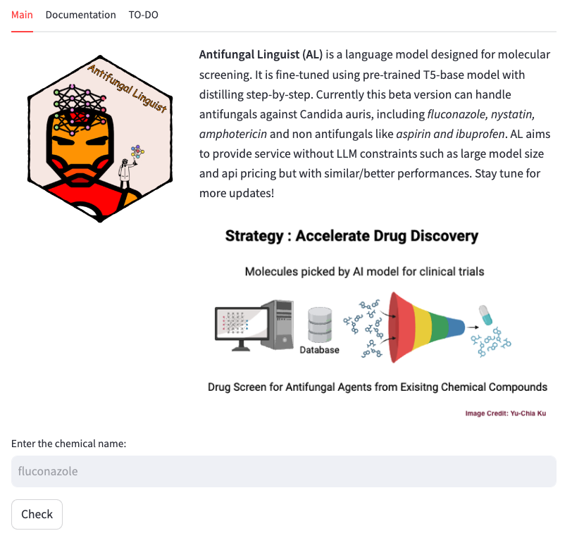

# Antifungal Linguist

Start the project by creating a virtual environment and installing all required packages

```shell
python3 -m venv myenv
pip install -r requirements.txt
```

**T5 (Text-To-Text Transfer Transformer)** is a family of models developed by Google AI and it is designed for various natural langugage understanding and generating tasks. It has been pre-trained on large language corpus and fine-tuned for different NLP tasks. 

In this project, we use [HuggingFace T5-base](https://huggingface.co/t5-base) and transformers to handle text input and generate text output.

First, we use [PubChemPy](https://pubchempy.readthedocs.io/en/latest/) package to analyze the text from user input. Users can type common name, chemical name, and [SMILE structure](https://en.wikipedia.org/wiki/Simplified_molecular-input_line-entry_system), and we convert them to chemical name for our next steps.

Second, we use the pre-trained T5 model and fine-tune using [distilling step-by-step](https://arxiv.org/abs/2305.02301) method from LLM prompt output, aiming to have a task specific and also flexible generative language model for drug discovery. 




